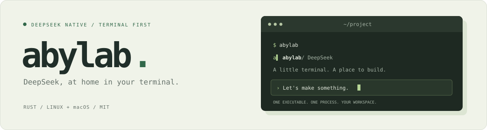

<p align="center">
  
</p>

<p align="center">
  <strong>让想法，在终端里发生。</strong><br>
  一个可执行文件，让 AI 和你一起写代码、解问题、把事情做完。
</p>

<p align="center">
  <strong>中文</strong> · <a href="README.en.md">English</a> · <a href="https://abylab.ai/">官网</a> · <a href="CHANGELOG.md">更新日志</a> · <a href="TECH.md">技术文档</a>
</p>

---

abylab 是一个开源免费的极简主义 AI 助理：你可以用它来编程、修改 Excel 文件、写报告、调整电脑设置，
只需要给它配上 DeepSeek API Key 就可以开始干活。

- **轻巧** — 一个可执行文件，安装后即可运行。
- **顺手** — 终端原生界面、文件提及、主题切换。
- **自由** — MIT 开源，随时阅读、修改、自己构建。

## 快速开始

### 1 · 安装 abylab

在你的终端中执行下面语句：

```sh
curl -fsSL https://abylab.ai/install.sh | bash
```

支持 Linux · macOS · 安装到 `~/.local/bin/abylab`

### 2 · 准备 API Key

去 [platform.deepseek.com](https://platform.deepseek.com/) 取一个 API Key。

### 3 · 启动，然后登录

在终端里运行 `abylab`，然后在输入框里登录一次：

```text
/login sk-xxxxxxxx
```

### 4 · 开始工作

直接输入你的要求，开始工作。

> 想从源码构建：`cargo build --release`。安装脚本支持 `--bin-dir`、`--version`、`--no-path`、`--path-file`、`--help`。
>
> 想卸载 abylab：运行 `abylab --uninstall`。

## 在终端里，顺手就好

| 按键 | 操作 |
| :--- | :--- |
| `enter` | 发送 / 排队 |
| `ctrl+enter` | 插话 |
| `esc` 连按两次 | 中断 / 清空草稿 |
| `ctrl+c` | 清空 / 退出 |
| `ctrl+q` | 退出（再按一次确认） |
| `↑` | 输入历史 |
| `ctrl+z` | 撤销 |
| `/` | 命令 |
| `@` | 文件提及 |
| `ctrl+p` | 切换模型 |
| `ctrl+t` | 切换主题 |
| `alt+↑`（mac `⌥↑`） | 编辑排队命令 |
| `shift+tab` | 切换权限预设 |

完整映射见 TUI 里的 `/keys`，命令帮助见 `/help`。

<details>
<summary><strong>排队命令与交互问答</strong></summary>

`alt+↑` 只在有排队命令、草稿为空时打开列表：`↑/↓` 选择 · `enter` 编辑 ·
`ctrl+enter` 把这条插话进正在跑的轮次 · `ctrl+d` 删除（同一行按两次）。

任务执行中，abylab 可以弹出问题并等待你的回答。问题可以是是/否、多个选项的单选或多选，
也可以直接输入文字；用 `↑/↓` 选择、空格切换多选、`enter` 提交、`esc` 取消。

</details>

<details>
<summary><strong>配置与凭据</strong></summary>

`/login` 存下就生效，不用重启。API Key 写入 `~/.abylab/.credentials.yaml`
（0600，仅属主可读）。凭据永远不从环境变量读：abylab 不读 `DEEPSEEK_API_KEY`，
也不读任何别的凭据环境变量；`--api-key <key>` 只是本次运行的覆盖项，永远不会落盘。

你的偏好存在 `$ABYLAB_HOME/settings.json`：界面语言（默认中文）、模型、推理强度、
权限预设，以及外观（明暗 + 主题包）。命令行开关只覆盖本次运行。

</details>

## 许可与致谢

[MIT License](LICENSE) · © 2025 zhang@qimiao.org

本项目参考了 [DeepSeek Harness](https://github.com/deepseek-ai/deepseek-harness)
与 [pi.dev](https://pi.dev/)。
