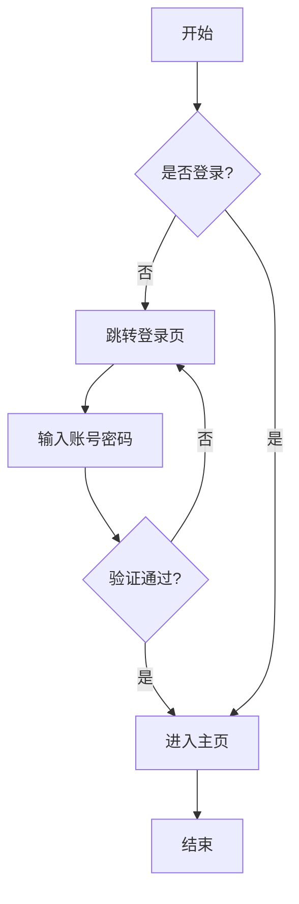
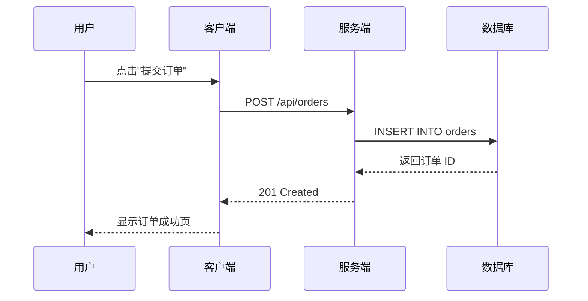
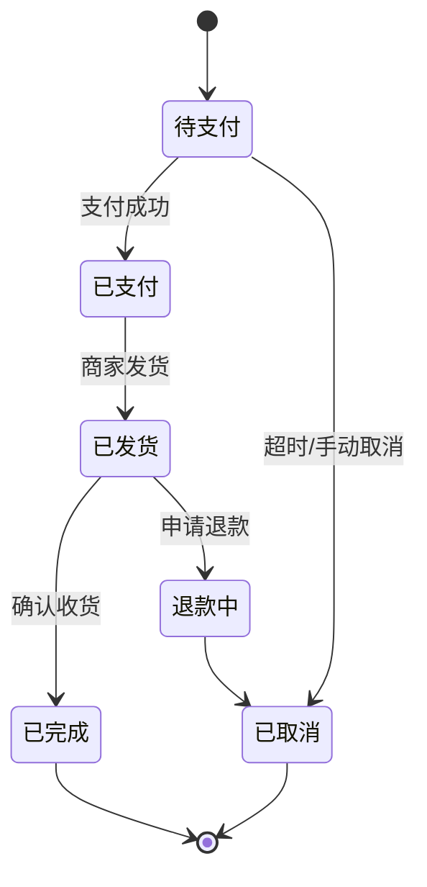

# 📘 复杂 Markdown 文档示例

> **版本**：v2.3.1 &nbsp;|&nbsp; **作者**：Harness 团队 &nbsp;|&nbsp; **更新日期**：2025-01-15<br>
> 本文档演示 Markdown 的各类高级语法，包括表格、代码块、数学公式、图表、任务清单等。

---

## 目录

1. [标题与文本](#1-标题与文本)
2. [列表与嵌套](#2-列表与嵌套)
3. [表格](#3-表格)
4. [代码与语法高亮](#4-代码与语法高亮)
5. [数学公式](#5-数学公式)
6. [图表（Mermaid）](#6-图表mermaid)
7. [任务清单](#7-任务清单)
8. [引用与脚注](#8-引用与脚注)
9. [链接与图片](#9-链接与图片)
10. [定义列表与缩略语](#10-定义列表与缩略语)

---

## 1. 标题与文本

### 1.1 文本样式

| 样式 | 语法 | 效果 |
|------|------|------|
| 粗体 | `**bold**` | **bold** |
| 斜体 | `*italic*` | *italic* |
| 删除线 | `~~strike~~` | ~~strike~~ |
| 行内代码 | `` `code` `` | `code` |
| 高亮 | `==mark==` | ==mark== |
| 下标 | `H~2~O` | H~2~O |
| 上标 | `x^2^` | x^2^ |

### 1.2 分隔线

上面是分隔线，下面是三种不同的水平线写法：

***
---
___

---

## 2. 列表与嵌套

### 2.1 无序列表（多层嵌套）

- 一级项目
  - 二级项目
    - 三级项目
      - 四级项目
        - 还可以继续嵌套
- 另一个一级项目

### 2.2 有序列表（自定义起始值 + 嵌套）

3. 从 3 开始编号
   1. 嵌套的有序列表
   2. 第二项
4. 继续编号
   - 有序里嵌套无序
   - 再来一条

### 2.3 混合嵌套 + 段落

1. **第一步**：安装依赖

   这是一段嵌套在列表项内的段落，需要缩进 4 个空格（或一个 Tab）。

   ```bash
   npm install
   ```

2. **第二步**：运行项目

   > 列表项内还可以嵌套引用块。

---

## 3. 表格

### 3.1 基础表格 + 对齐

| 功能 | 状态 | 优先级 | 完成度 |
|:-----|:----:|-------:|-------:|
| 用户认证 | ✅ 完成 | 高 | 100% |
| 数据同步 | 🚧 进行中 | 高 | 60% |
| 报表导出 | ⏳ 待开始 | 中 | 0% |
| 消息推送 | 🔴 阻塞 | 紧急 | 30% |

### 3.2 复杂单元格（含代码与链接）

| 模块 | 命令 | 说明 |
|------|------|------|
| 构建 | `npm run build` | 生产环境打包，产物输出至 `dist/` |
| 测试 | `npm test -- --coverage` | 运行测试并生成覆盖率报告（详见 [Jest 文档](https://jestjs.io)） |
| 部署 | `./deploy.sh --env prod` | 一键部署，需要先配置 `.env` |

---

## 4. 代码与语法高亮

### 4.1 JavaScript

```javascript
// 异步处理 + 泛型示例
async function fetchData<T>(url: string): Promise<T> {
  const response = await fetch(url, {
    headers: { 'Content-Type': 'application/json' },
  });

  if (!response.ok) {
    throw new Error(`HTTP ${response.status}: ${response.statusText}`);
  }

  return response.json() as Promise<T>;
}
```

### 4.2 Python

```python
from dataclasses import dataclass
from typing import Optional

@dataclass
class User:
    id: int
    name: str
    email: Optional[str] = None

    def greet(self) -> str:
        """返回问候语。"""
        return f"你好，{self.name}！"

users = [User(1, "Alice", "alice@example.com"), User(2, "Bob")]
print("\n".join(u.greet() for u in users))
```

### 4.3 SQL

```sql
SELECT
  u.id,
  u.username,
  COUNT(o.id) AS order_count,
  SUM(o.amount) AS total_spent
FROM users u
LEFT JOIN orders o ON o.user_id = u.id
WHERE u.created_at >= '2024-01-01'
  AND u.status = 'active'
GROUP BY u.id, u.username
HAVING COUNT(o.id) > 5
ORDER BY total_spent DESC
LIMIT 20;
```

### 4.4 行内代码与转义

使用 `const x = \`template\`` 表示模板字符串；反引号需要用反斜杠转义，例如 \`\` ` ``code`` ` \`\`。

---

## 5. 数学公式

### 5.1 行内公式

质能方程 $E = mc^2$，欧拉公式 $e^{i\pi} + 1 = 0$。

### 5.2 块级公式

正态分布概率密度函数：

$$
f(x) = \frac{1}{\sigma\sqrt{2\pi}} e^{-\frac{(x-\mu)^2}{2\sigma^2}}
$$

贝叶斯定理：

$$
P(A \mid B) = \frac{P(B \mid A) \cdot P(A)}{P(B)}
$$

求和与积分示例：

$$
\sum_{n=1}^{\infty} \frac{1}{n^2} = \frac{\pi^2}{6}, \qquad \int_{-\infty}^{\infty} e^{-x^2} dx = \sqrt{\pi}
$$

---

## 6. 图表（Mermaid）

### 6.1 流程图



### 6.2 时序图



### 6.3 状态图



---

## 7. 任务清单

### 本周开发计划

- [x] 完成用户模块重构
- [x] 编写单元测试（覆盖率 85%+）
- [ ] 接入第三方支付 SDK
- [ ] 优化首页加载性能
- [ ] 修复已知 Bug #128
- [ ] 撰写发布说明

---

## 8. 引用与脚注

### 8.1 多级引用

> 一级引用
> > 二级引用
> > > 三级引用，可以无限嵌套。
> >
> > 回到二级引用。
>
> 回到一级引用。

### 8.2 脚注

Markdown 支持脚注语法[^1]，引用处自动编号[^2]，脚注内容通常渲染在文末。

[^1]: 这是第一个脚注的详细说明。
[^2]: 这是第二个脚注，可以包含**格式**和[链接](https://example.com)。

---

## 9. 链接与图片

### 9.1 链接

- **自动链接**：<https://www.example.com>
- **标题链接**：[Example 官网](https://www.example.com "访问 Example 官网")
- **引用式链接**：这是一个[引用式链接][ref-link]。

[ref-link]: https://www.example.com "引用式链接的目标"

### 9.2 图片


### 9.3 HTML 嵌入

<details>
<summary><b>点击展开：HTML 折叠面板</b></summary>

这里是折叠面板中的内容，可以放置任意 Markdown 或 HTML。

- 支持列表
- 支持表格

| A | B |
|---|---|
| 1 | 2 |

</details>

---

## 10. 定义列表与缩略语

术语
: 这是对"术语"的定义。定义列表使用 `:` 引导定义内容。

API
: Application Programming Interface，应用程序编程接口。

HTML
: HyperText Markup Language，超文本标记语言。

---

## 附录：ASCII 艺术与注意事项

```
   _____                      _           _
  / ____|                    | |         | |
 | |     ___  _ __ ___  _ __ | | ___  ___| |_
 | |    / _ \| '_ ` _ \| '_ \| |/ _ \/ __| __|
 | |___| (_) | | | | | | |_) | |  __/ (__| |_
  \_____\___/|_| |_| |_| .__/|_|\___|\___|\__|
                       | |
                       |_|
```

> ⚠️ **注意**：不同 Markdown 渲染器（GitHub、Typora、VSCode、Obsidian）对语法的支持程度不同。数学公式、Mermaid、任务清单、脚注等属于扩展语法，部分平台可能不支持。

---

*— 文档结束 —*
